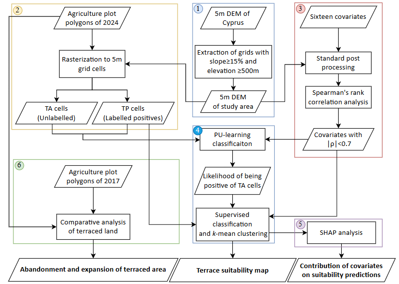
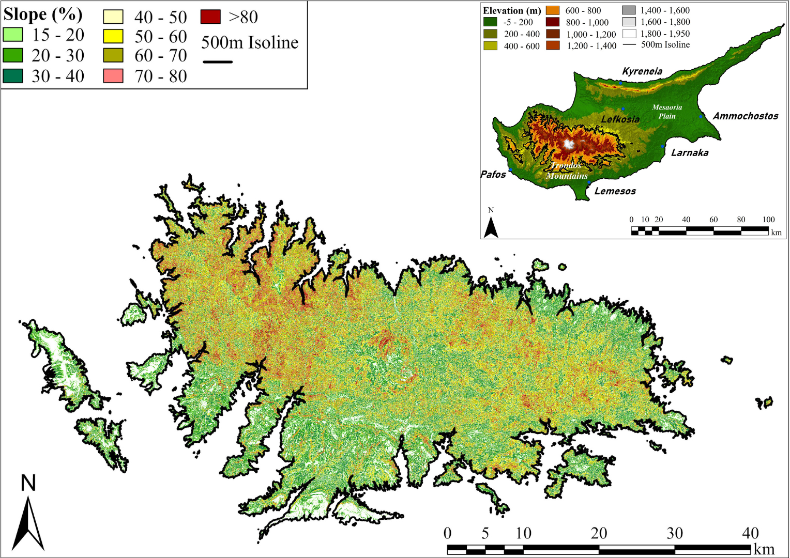

# A machine learning framework for predicting agriculture terrace suitability using positive and unlabelled datasets: an application for the Troodos Mountains, Cyprus
_____

## Authors
#### Aman Kumar Meena1, Christos Zoumides1, Hakan Djuma1, Ioannis Sofokleous1, Corrado Camera2 and Adriana Bruggeman1  
1Energy, Environment and Water Research Centre, The Cyprus Institute, Aglantzia, Lefkosia 2121, Cyprus  
2Dipartimento di Scienze della Terra “A. Desio”, Università degli Studi di Milano, Via Mangiagalli 34, 20133 Milan, Italy
______

## Abstract
Terraces are a defining feature of Mediterranean mountain landscapes, enabling agriculture on steep slopes while providing multiple ecosystem services. Land suitability analysis (LSA) can guide authorities and land users to sustainably manage and expand these environments. It typically requires fully labelled datasets, but in many real-world applications only a fraction of positive examples is available, with the rest unlabelled. This study aims to present an integrated predictive modelling framework that combines GIS with data-driven Machine Learning (ML) techniques, capable of learning from positive and unlabelled datasets for LSA. The proposed framework was applied to develop a terrace suitability map for Cyprus’ Troodos Mountain. A 5-m DEM was processed to extract the mountain area, with elevation ≥500m and slopes ≥15%, defining the study area. Crop plots registered under the Single Area Payment Scheme of the European Common Agricultural Policy were used to classify the study area into Terrace-Present (TP) and Terrace-Absent (TA) cells, with TP serving as labelled positive and TA as unlabelled samples. A two-step ML approach was applied, first identifying reliable negatives from TA cells, then using these with TP cells for suitability prediction. Feature importance analysis identified land cover, terrain slope and tree cover density as the most influential parameters for terrace suitability. Comparative analysis between 2017 and 2024 revealed abandonment of terraced agricultural land (29% decrease) as well as revitalization (12% increase). The resulting suitability map and accompanying data layers are accessible through a Google Earth Engine application, aiming to support informed decision-making for sustainable landscape planning.

This research was supported by the REACT4MED Project (GA 2122), which is funded by PRIMA, the Partnership for Research and Innovation in the Mediterranean Area, a Programme supported by Horizon 2020, the European Union’s Framework Programme for Research and Innovation.
______

## Objective 
1. To present an integrated predictive modelling framework that combines GIS with data-driven ML techniques, capable of learning from positive and unlabelled datasets for terrace suitability analysis  
2. To generate a high-resolution terrace suitability map for the Troodos Mountains, Cyprus
3. To analyse the environmental, regulatory and socio-economic parameters that affect the suitability of land for mountain terraces
4. To analyse recent land use dynamics (i.e., abandonment and expansion of mountain terraces)
_______

## Methodology 
This study was structured in six sequential steps (Fig. 1). First, elevation and slope criteria were used to delineate the mountain area. Second, within this area, all crop plots were assumed to be terraced land. Following this assumption, areas occupied by these crop plots were classified as Terrace-Present (TP) and areas without crop plots were classified as Terrace-Absent (TA). Third, 16 covariates were identified and a correlation analysis was performed to reduce redundancy among variables. Fourth, a hybrid framework of PU-learning and supervised XGBoost classification was adopted to predict the suitability of terrace agriculture using the refined set of non-redundant covariates. The resulting continuous suitability scores were then classified into four distinct suitability classes using the k-means clustering method. Fifth, the SHapley Additive exPlanations (SHAP) analysis was performed to evaluate the influence of individual covariates on land suitability. Finally, agricultural crop plots of 2017 and 2024 were utilized to determine the abandonment and expansion of these environments and corresponding suitability classes. The following sections provide a detail description of each step.

   
  <em>Fig.1 Conceptual workflow summarizing the six methodological steps adopted for suitability mapping, feature importance analysis and recent land use dynamics; rectangles denote computational processes and parallelogram show data inputs/outputs .</em>

_________

## Study Area
The study area comprises the Troodos Mountains, located in Cyprus and encompassing approximately 40% of the island, with a maximum elevation of 1,951 m a.s.l. For the purposes of this study, areas with elevations ≥500 m and slope gradients ≥15% were delineated in accordance with the Cyprus Rural Development Program and FAO guidelines, representing the minimum topographic thresholds suitable for bench terrace construction.  

   
  <em>Fig.2 Elevation map of Cyprus with the 500 m isoline and slope map of areas above 500 m, highlighting the Troodos Mountains, delineated using the 5-m DEM (Kyriakou, 2022) .</em>

## Scripts
Python scripts for analysis and modeling.

## Results
Final suitability maps and outputs.
